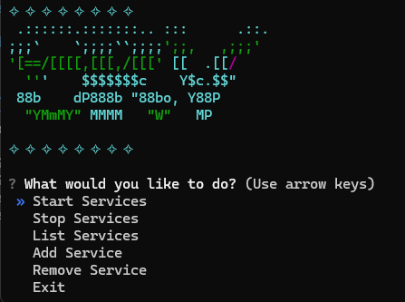

# Service App



## Overview

 **srv** is designed to streamline the process of managing services and users. It provides a user-friendly interface to add, update, and remove service-related information. The app is written in Python and uses a simple, straightforward approach to handling data through easy-to-navigate commands.

## Features
- **Add New Service Entries**: add new services.
- **Update Existing Services**: edit services.
- **Remove Services**: remove services.
- **View Services**: Get an overview of all current services at a glance.

## Getting Started

### Prerequisites
- Python 3.x installed on your system.
- Basic understanding of Python.

### Installation
1. **Clone the Repository**:
   ```sh
   git clone https://github.com/yourusername/service-app.git
   ```
2. **Navigate to the Project Directory**:
   ```sh
   cd service-app
   ```
3. **Create a Virtual Environment**:
   ```sh
   python -m venv venv
   ```
4. **Activate the Virtual Environment**:
   ```sh
   # On Windows
   .\venv\Scripts\Activate.ps1

   # On Linux/macOS
   source venv/bin/activate
   ```
5. **Install Dependencies**:
   ```sh
   pip install -r requirements.txt
   ```

### Usage
To run srv, simply execute the PowerShell script provided:

```powershell
./run.ps1
```

This script will activate the venv, and run the app.

You will be prompted with options to add, update, view, or remove service records.

## File Structure
- `srv.py`: The main file containing the service management logic.
- `srv.png`: Screenshot of the user interface.
- `README.md`: Documentation for understanding the setup and usage.
- `requirements.txt`: (If required) A list of dependencies.
- `run.sh`: A script to easily run the application on Linux/macOS.
- `run.ps1`: A script to easily run the application on Windows.

## License
This project is licensed under the MIT License. See `LICENSE` for more information.

